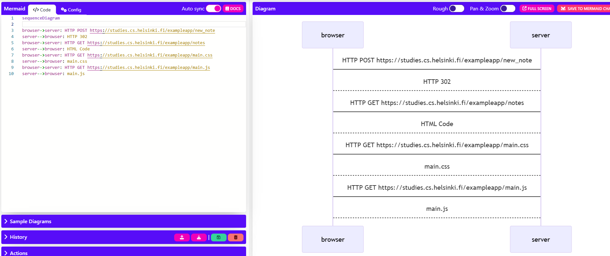

# Exercise 0.4
sequenceDiagram

browser->server: HTTP POST https://studies.cs.helsinki.fi/exampleapp/new_note  
server-->browser: HTTP 302  
browser->server: HTTP GET https://studies.cs.helsinki.fi/exampleapp/notes  
server-->browser: HTML Code  
browser->server: HTTP GET https://studies.cs.helsinki.fi/exampleapp/main.css  
server-->browser: main.css  
browser->server: HTTP GET https://studies.cs.helsinki.fi/exampleapp/main.js  
server-->browser: main.js  

