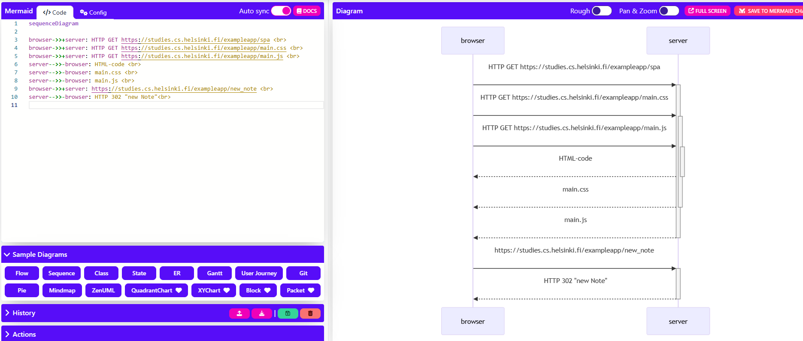

# Exercise 0.6
sequenceDiagram

browser->>+server: HTTP GET https://studies.cs.helsinki.fi/exampleapp/spa  
browser->>+server: HTTP GET https://studies.cs.helsinki.fi/exampleapp/main.css  
browser->>+server: HTTP GET https://studies.cs.helsinki.fi/exampleapp/main.js  
server-->>-browser: HTML-code  
server-->>-browser: main.css  
server-->>-browser: main.js  
browser->>+server: https://studies.cs.helsinki.fi/exampleapp/new_note  
server-->>-browser: HTTP 302 "new Note" 

